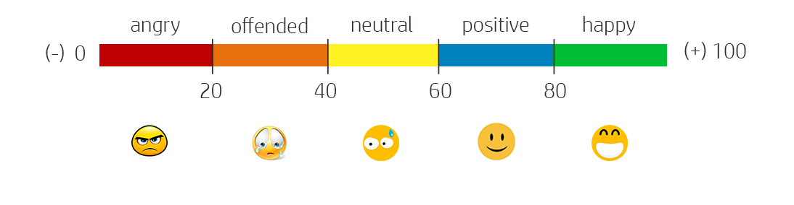
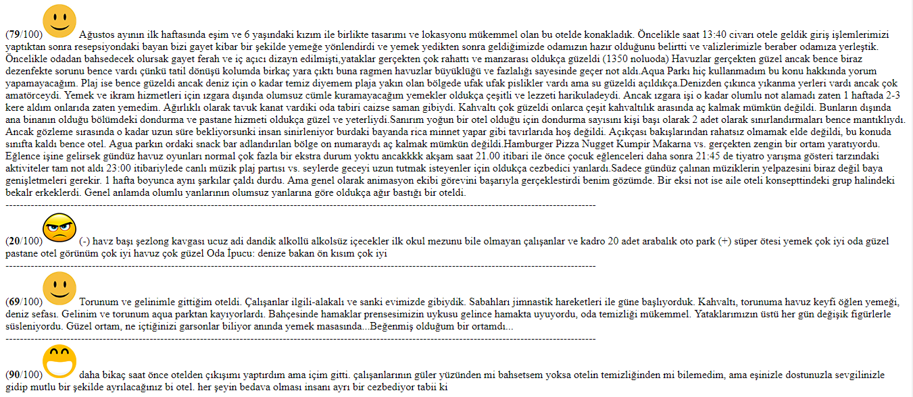

# CLASSIFIER CLASS WITH PHP

# Rated

# Using

    $classifier = new classifier;
    $comment    = 'Mimarisini en cok begendigim otel denize bakan odalarda balkona ciktiginizda kendinizi bir crouse gemisinde yolculuk yapar gibi hissediyorsunuz. Odalar gayet kaliteli malzemeler kullanilarak dizayn edilmis hersey icin tesekkurler vikingen';
    $rate = $classifier->classify($comment);
    echo '(<b>'.$rate.'</b>/100)smile().'.png"> '.$comment;

# Shoot Screen

